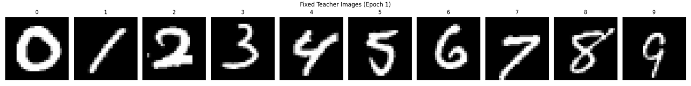
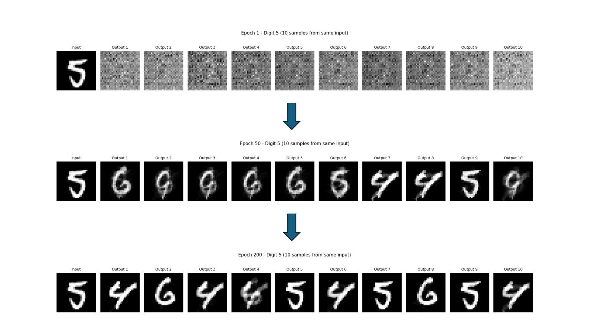
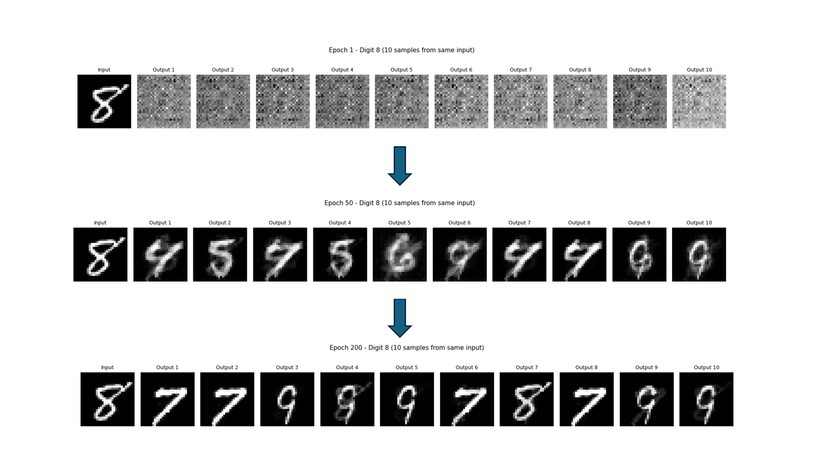
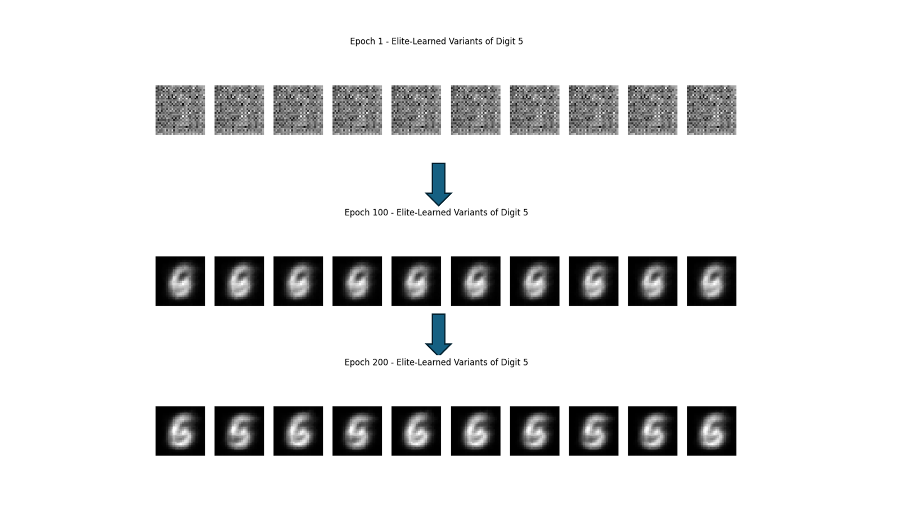

# Sekitori MNIST

## 学習スクリプト

### train_fixed.py（固定教師版）✅ 動作確認済み

各数字に対して1枚の教師画像を固定して学習します。教師がバッチをまたいで変わらないため席取り割り当てが安定し、正しく機能します。

```bash
python train_fixed.py
```

**固定教師画像（0〜9 各1枚）**



**数字 5 の生成結果（Epoch 1 → 50 → 200）**

同じ入力から潜在空間をサンプリングして10パターン生成。学習が進むにつれて5らしい形が安定して出力されています。



**数字 8 の生成結果（Epoch 1 → 50 → 244）**

同様に8を生成。エポックが進むと8の形がはっきり現れます。



### train_random.py（ランダム教師版）❌ 未解決

バッチごとに教師画像をランダムサンプリングする実装です。教師がバッチごとに変わるため席取り割り当てが安定せず、現状ではうまく機能しません。

```bash
python train_random.py
```

**数字 5 の生成結果（Epoch 1 → 100 → 200）**

学習が進んでも出力がノイズ状のまま改善されず、機能していないことがわかります。



## 生成される画像

学習を実行すると `img_fixed/` または `img_random/` 以下に日付フォルダが作られ、以下の画像が保存されます。

### バッチごとに生成

| フォルダ | 内容 |
|---|---|
| `batch_teachers/` | バッチ内の先頭8サンプルについて、入力画像と教師3枚（digit-1・same・digit+1）を横並びで表示 |

### エポック終了時に生成

| フォルダ | 内容 |
|---|---|
| `latent_sekitori_target/` | 追跡数字（`TRACK_DIGIT`）の固定サンプルから生成した N 個の z を、席取り割り当て結果で色分けして PCA 可視化 |
| `latent_sekitori_mse/` | **【重要】** 同じ z を最近傍教師（最小 MSE）で色分けして PCA 可視化 |
| `latent_all_digits/` | 全 10 数字の μ と z サンプルを PCA で2次元に落として可視化 |
| `sekitori_teachers/` | 追跡数字の入力画像と使用された教師3枚を横並びで表示 |
| `digit_variations_5/` | 数字 5 の固定教師画像を encode し、同じ μ/logvar から 10 パターン生成して比較 |
| `digit_variations_8/` | 数字 8 の固定教師画像を encode し、同じ μ/logvar から 10 パターン生成して比較 |
| `teachers/` | 固定教師画像（0〜9 各1枚）の一覧（`train_fixed.py` のみ） |
